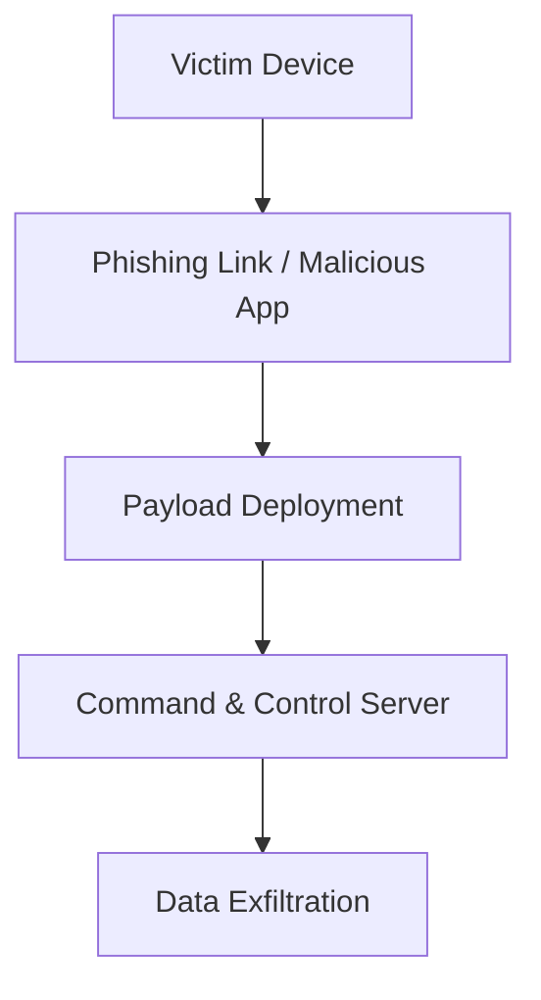

# Predator Spyware Exposed: Architecture, Infrastructure, and Attack Lifecycle

This article is a professional **Cyber Threat Intelligence (CTI)** report on **Predator spyware**, covering its architecture, infrastructure, attack lifecycle, indicators of compromise (IOC), and mitigation strategies.  

---

## Overview

Predator spyware is a **highly sophisticated mobile spyware** targeting Android and iOS devices. It spreads via **phishing campaigns, malicious apps, and SMS (SMiShing)**. This report provides a full analysis for CTI professionals and researchers.  

---

## Attack Lifecycle Steps

1. **Initial Infection**  
   - SMS phishing campaigns (SMiShing)  
   - Malicious URLs and trojanized apps  

2. **Payload Deployment**  
   - Silent installation on victim devices  
   - Escalation of privileges  

3. **Command & Control (C2)**  
   - Communication with remote servers for instructions  
   - Exfiltration of sensitive data (messages, calls, contacts, location)  

4. **Data Exfiltration**  
   - Data sent to attacker-controlled servers  
   - Multi-layer obfuscation to evade detection  

---

## Infrastructure Analysis (Observed Data)

Predator spyware relies on a **multi-tiered infrastructure**, designed to obfuscate its origin and evade detection. Analysts have observed several technical characteristics of this infrastructure:

### Active Domains & Delivery Infrastructure
Several domains have been publicly linked to Predator operations:

- `southchinapost[.]net` – Predator infection URL ([Amnesty International](https://www.amnesty.org/en/wp-content/uploads/2023/11/ACT1072452023ENGLISH.pdf))  
- `scanningandinfo[.]online` – used to host Predator installation payloads ([Amnesty International](https://www.amnesty.org/en/wp-content/uploads/2023/11/ACT1072452023ENGLISH.pdf))  
- `canylane[.]com` – identified as part of Predator infrastructure ([Hendry Adrian](https://www.hendryadrian.com/predator-still-active-with-new-client-and-corporate-links-identified/))  
- `flickerxxx[.]com` – domain linked to Predator delivery ([Hendry Adrian](https://www.hendryadrian.com/predator-still-active-with-new-client-and-corporate-links-identified/))  
- `noticiafamosos[.]com`, `mdundobeats[.]com`, `onelifestyle24[.]com` – observed in Predator campaigns in Mozambique ([Recorded Future](https://www.recordedfuture.com/research/predator-still-active-new-links-identified))

> **Note:** Predator operators rotate domains frequently to avoid blocking.

### Hosting IPs & Network Evidence
CTI sources have mapped several IP addresses associated with Predator infrastructure:

- `169.239.128.42` – delivery infrastructure ([Hendry Adrian](https://www.hendryadrian.com/predator-still-active-with-new-client-and-corporate-links-identified/))  
- `169.239.129.57` – Predator-related hosting ([Hendry Adrian](https://www.hendryadrian.com/predator-still-active-with-new-client-and-corporate-links-identified/))  
- `45.86.163.182` – additional Predator infrastructure ([Hendry Adrian](https://www.hendryadrian.com/predator-still-active-with-new-client-and-corporate-links-identified/))

These IPs span multiple ASNs, showing Predator’s use of distributed hosting to complicate tracking.

### Obfuscation & Multi-Tiered Architecture
Predator’s infrastructure is organized in **multiple layers**:

1. **Tier 1 – Delivery / C2 Servers**: Immediate payload delivery and command servers, sometimes impersonating legitimate sites ([Recorded Future](https://www.recordedfuture.com/research/predator-still-active-new-links-identified))  
2. **Tier 2 – Upstream VPS**: Anonymization nodes using VPS hosting, often TCP port 10514 ([Recorded Future](https://www.recordedfuture.com/research/predator-still-active-new-links-identified))  
3. **Tier 3 / 4 – Relay Nodes**: Intermediate servers, ISP-hosted infrastructure under third-party control ([Recorded Future](https://www.recordedfuture.com/research/predator-still-active-new-links-identified))  
4. **Tier 5 – Obfuscation Layer**: Additional hops and external networks, e.g., Czech-based nodes ([Recorded Future](https://www.recordedfuture.com/research/predator-still-active-new-links-identified))

This layered design hides Predator’s infrastructure and complicates attribution and takedown.
---

## Indicators of Compromise (IOC)

Below are concrete indicators associated with Predator spyware activity observed in publicly released threat intelligence reports and databases:

### Domains and URLs
These domains have been linked to Predator campaigns or delivery infrastructure:  
- `southchinapost[.]net` – delivery domain seen in active campaigns :contentReference[oaicite:0]{index=0}  
- `scanningandinfo[.]online` – hosting Predator payloads :contentReference[oaicite:1]{index=1}  
- `asean-news[.]net`, `newsworldsports[.]co` – additional Predator‑associated domains :contentReference[oaicite:2]{index=2}  
- `hxxps://redirecting[.]page:443/9cdfb439c7876e703e307864c9167a15/vsk/afile` – example malicious URL observed in CTI feeds :contentReference[oaicite:3]{index=3}  

### IP Addresses
IP addresses that have been tied to Predator-related infrastructure through CTI research:  
- `169.239.128.42` – Predator delivery/C2 server :contentReference[oaicite:4]{index=4}  
- `169.239.129.57` – Predator‑linked hosting :contentReference[oaicite:5]{index=5}  
- `45.86.163.182` – Additional infrastructure IP :contentReference[oaicite:6]{index=6}  

> ⚠️ Note: IPs and domains used by Predator change frequently as operators rotate infrastructure to evade detection and blocking.

### File Hashes
Known malware sample hashes associated with Predator activity (useful for detection rules and scanning tools):  
- `8e4edb1e07ebb86784f65dccb14ab71dfd72f2be1203765b85461e65b7ed69c6` (SHA‑256) — associated Predator sample :contentReference[oaicite:7]{index=7}  

---

**IOC Usage Tips (for CTI / SOC Teams):**  
- Monitor network logs for connections to the above domains or IPs.  
- Add the known hash to your malware scanning rules.  
- Validate IOC relevance with recent threat feeds before blocking to avoid false positives. 

---

## Mitigation & Recommendations

- Educate users about phishing risks  
- Install reputable mobile security applications  
- Monitor network traffic for suspicious connections  
- Keep devices and apps updated regularly  

---

## Navigation

- ← [Tools & Frameworks](tools.md)  
- Home → [HunterX Lab Home](index.md)  
- Next → [Threat Reports](threat-reports.md)
